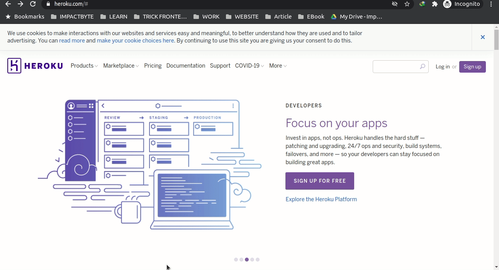

# _Deploy_ website menggunakan Heroku

Berikut ini adalah cara melakukan deployment website anda di [Heroku](https://www.heroku.com/).

1. Buka tautan [ini](https://www.heroku.com/).

2. Klik **Log in** jika anda sudah memiliki akun atau klik **Sign Up** jika belum memiliki akun. 

3. Kita coba **Sign Up** terlebih dahulu, lengkapi form yang tersedia kemudian klik tombol _CREATE FREE ACCOUNT_, kemudian cek email kita untuk verifikasi akun yang sudah kita buat. 

4. Cek Email yang digunakan untuk mendaftar kemudian klik link yang diberikan untuk konfirmasi akun yang sudah kita buat.

5. Setelah klik kita akan diarahkan ke halaman pembuatan _password_. Password yang kalian buat harus mengandung huruf, angka dan juga simbol.

6. Setelah semuanya selesai klik tombol _CLICK HERE TO PROCEED_, kemudian akan diarahkan menuju halaman utama heroku. Jika sudah semua dilakukan akun anda sudah terdaftar di heroku. 

7. Jika anda sudah memiliki akun bisa langsung klik tombol _Log In_. Kemudian masukan email dan password yang sudah dibuat.

8. Setelah proses berhasil akan diarahkan ke halaman utama heroku. 

9. Untuk melakukan _deployment_ di heroku. kita bisa pilih tombol _New_ dipojok kanan atas dan pilih _Create New App_.

10. Kemudian masukan nama aplikasi kita inginkan dan klik tombol _Create App_. 
_note: Buat aplikasi kita dengan nama yang berbeda dari yang sudah ada_

11. Setelah selesai kita hubungkan dengan akun github kita agar setiap perubahan yang terjadi heroku akan langsung melakukan _deployment_ ulang website kita.

12. Pilih repository yang akan kita _deploy_. Lalu pilih _Enable Automatic Deploys_ kemudian klik tombol _Deploy Branch_ dimana branchnya adalah **master**. 

13. Setelah proses deploy selesai akan muncul tombol view dibawah dan bisa kita klik untuk melihat website kita yang sudah di _deploy_ di heroku. 
