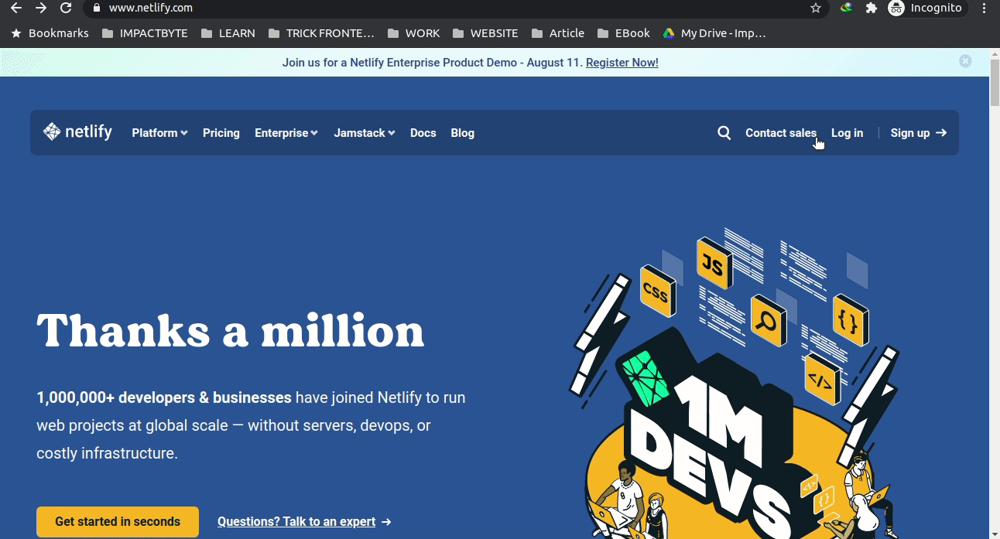
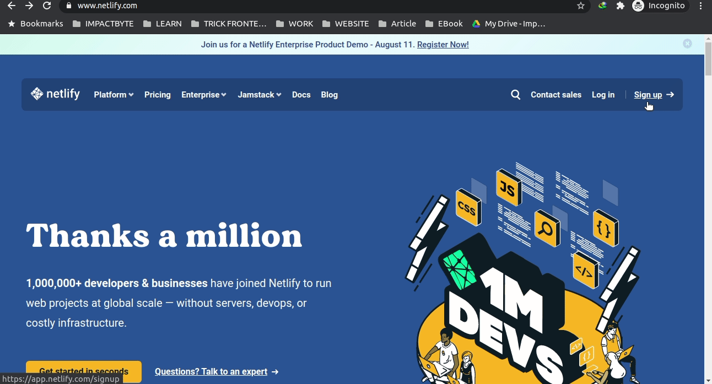
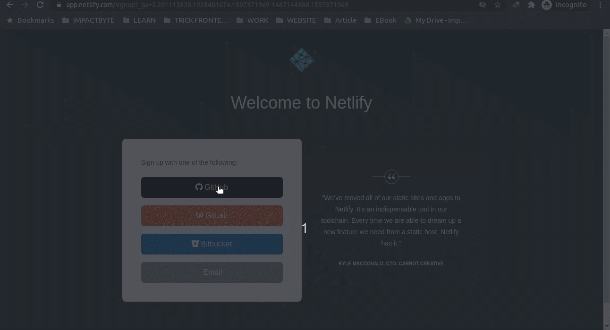
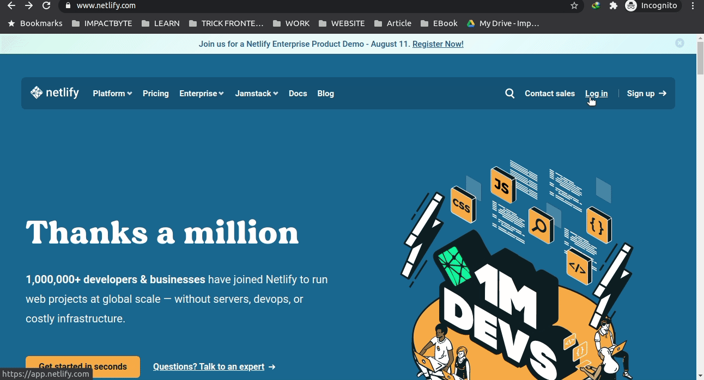
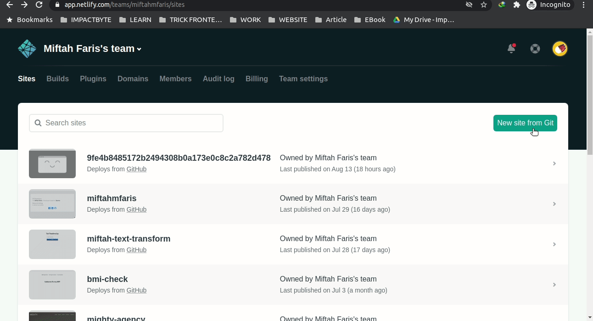
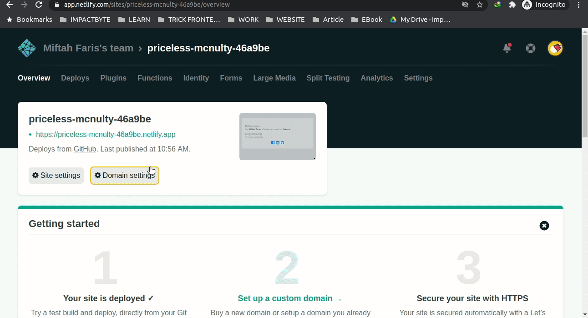

# _Deploy_ website menggunakan Netlify

Berikut ini adalah cara melakukan deployment website anda di [Netlify](https://www.netlify.com/).

1. Buka tautan [ini](https://www.netlify.com/) terlebih dahulu

2. Klik **Log in** jika anda sudah memiliki akun atau klik **Sign Up** jika belum memiliki akun. 

3. Kita coba **Sign Up** terlebih dahulu, direkomendasikan daftar menggunakan akun github agar terhubung dengan repository kita dan update secara _realtime_ 

4. Kemudian klik tombol github dan akan di _redirect_ ke halaman githubnya dan isi dengan akun github kita yang sudah terdaftar dan setelah berhasil akan di _redirect_ ke halaman utama dari Netlify 

5. Jika anda sudah pernah daftar sebelumnya tinggal klik _Login_ dan klik tombol github 

6. Setelah masuk ke halaman utama dari netlify, jika kita ingin _deploy_ salah satu website kita. Pilih tombol _New Site_, kemudian pilih github dan kita cari repository yang tersedia di github kita atau kita bisa cari repository kita. 

7. Kemudian pilih repository kita dan klik tombol _Deploy Site_, tunggu sampai selesai di _deploy_ oleh netlify. 

8. Setelah proses _deployment_ sudah selesai, netlify akan menampilkan link yang sudah bisa kita akses dan bisa kita klik. 

9. Proses _deployment_ di Netlify sudah selesai dan sudah bisa kita gunakan.

10. Kita juga bisa ubah link netlify kita dengan nama website kita sendiri, dengan klik _Domain Setting_ kemudian pilih tombol _Options_ dan _Edit site name_, setelah itu kita masukan nama site name yang kita inginkan. 