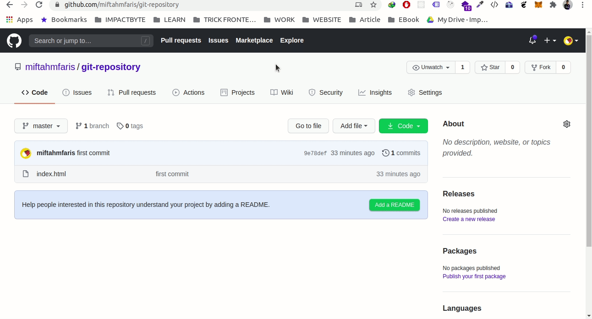
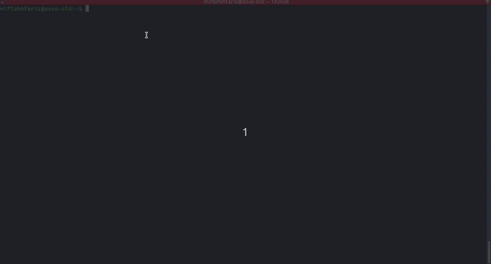
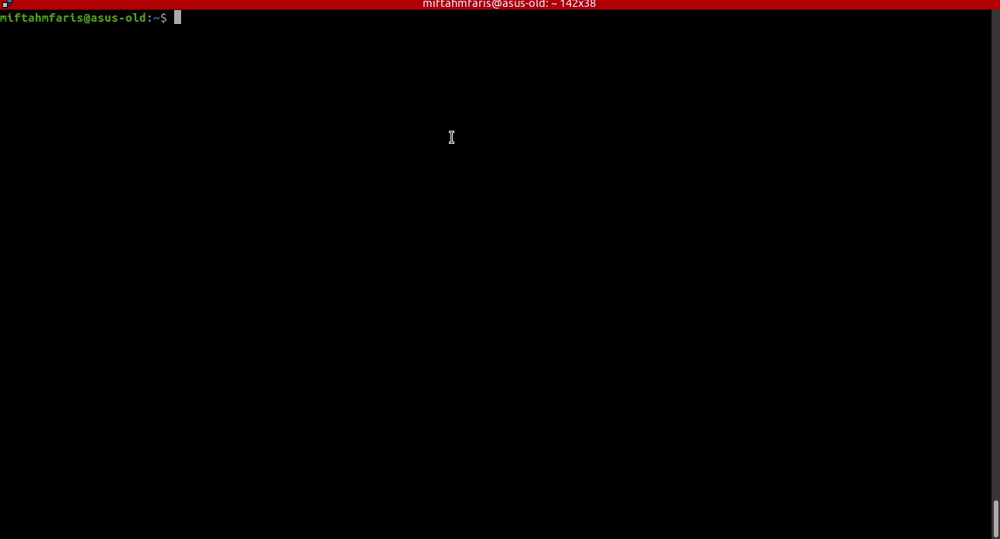

# Cara melakukan _Clone_ repositori

1. Buka halaman repositori yang ingin anda clone.

2. Kemudian _copy url_ dari repositori tersebut. 
   _note: kita bisa menggunakan url ssh atau https, \*\*ssh bisa digunakan jika kita sudah melakukan setup ssh terlebih dahulu._

3. Setelah disalin kita bisa jalankan perintah `git clone repositori_url` pada terminal. 

4. Setelah berhasil melakukan _clone_ akan otomatis membuat folder sesuai nama repositori yang ada digithub, dan bisa kita tambahkan kodingan kita. 
