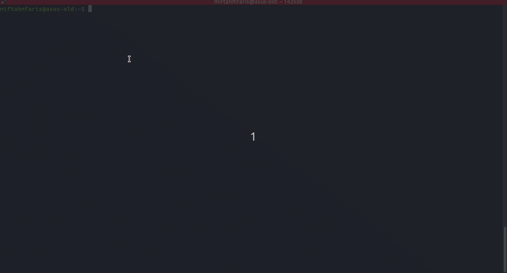
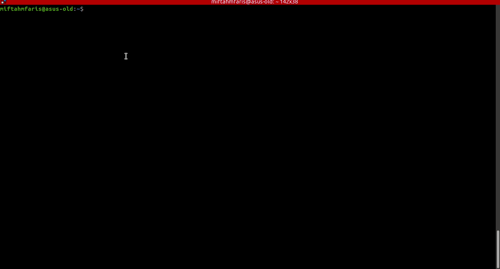
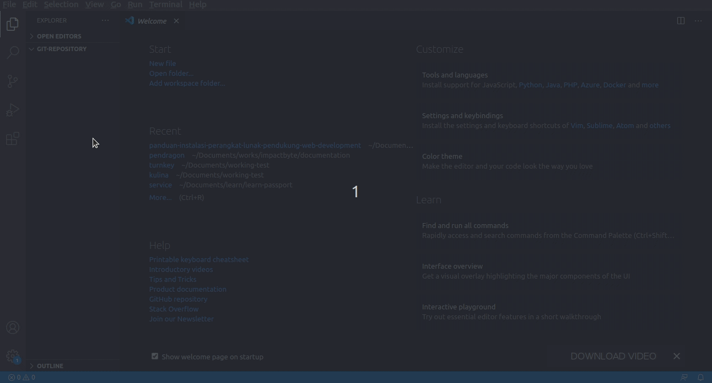
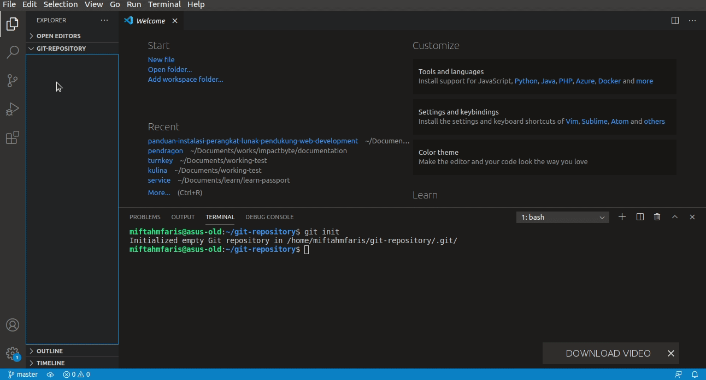
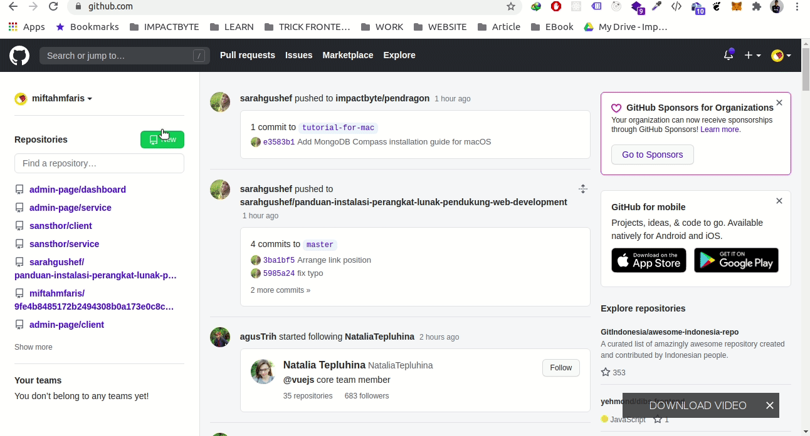
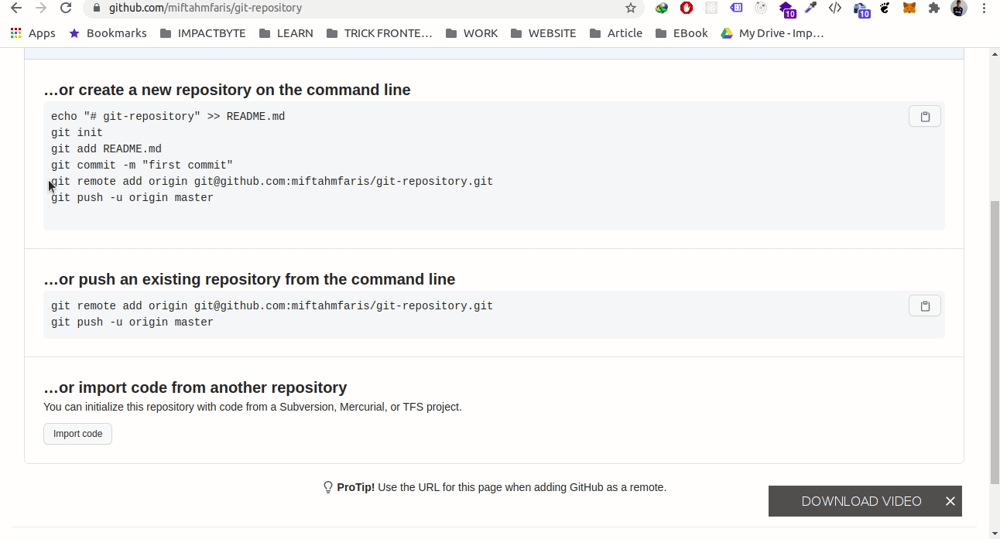
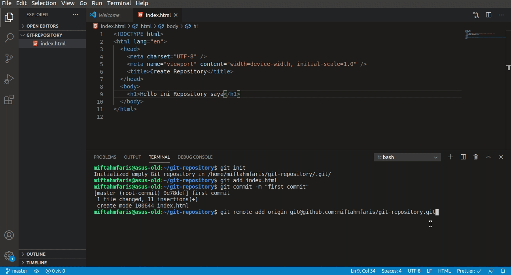
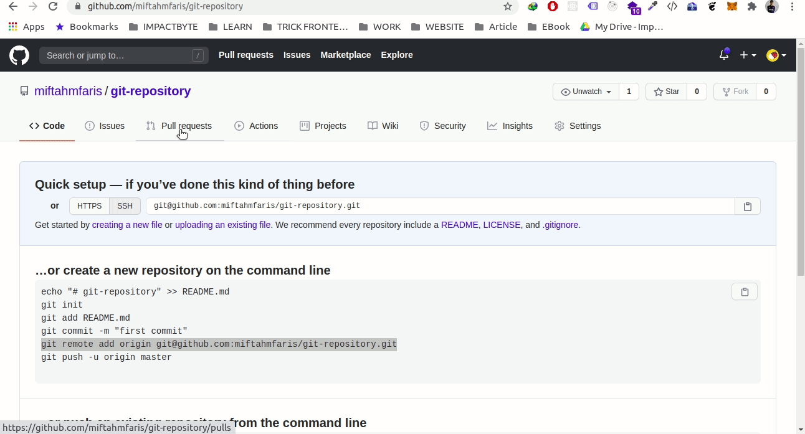

# Cara Membuat Git Repository

1. Sebelum kita membuat sebuah repository, kita harus melakukan inisialisasi nama pengguna kita dengan cara menjalankan perintah `git config --global user.name "nama_anda"` dan `git config --global user.email "email_anda"`. 

   ```bash
   git config --global user.name "John Doe"
   git config --global user.email "john.doe@email.com"
   ```

2. Setelah proses selesai jalankan perintah `git config --list` untuk mengecek apa konfigurasi kita sudah berhasil. 

   ```bash
   git config --list
   ```

3. Buatlah direktori baru, kemudian buka direktori yang sudah dibuat dengan menggunakan **IDE (VSCode, Atom dll)**. 

4. Setelah vscode anda terbuka, buka terminal di vscode dengan menekan tombol `` CTRL + ` ``. Untuk melakukan inisialisasi git, kita hanya jalankan perintah `git init`. 

   ```bash
   git init
   ```

5. Buatlah sebuah file, contoh html. Dan saat itu setiap perubahan dalam kodingan kita akan dicatat oleh git. Untuk mencacat setiap perubahan kodingan kita, kita harus menjalankan perintah `git add nama_file` untuk file tertentu yang ingin dicatat atau `git add .` untuk seluruh file. Kemudian jalankan `git commit -m "pesan_anda"`. 

   ```bash
   git add index.html
   git add .
   git commit -m "first commit"
   ```

6. Dengan ini git sudah mencatat semua perubahan yang ada pada kodingan kita secara lokal. Lakukan perintah `git add` dan `git commit` setiap ada perubahan.

7. Jika ingin menyimpan perubahan kodingan kita secara online. Bisa menggunakan github, gitlab, bitbucket atau yang lainnya.

8. Buatlah repository baru digithub. 

9. Kemudian kita sambungkan git lokal kita dengan github dengan menjalankan perintah `git remote add origin alamat_repository` pada terminal kemudian jalankan `git push origin master` untuk mengunggah git lokal kita ke repository github yang sudah kita buat. 
   

       ```bash
       git remote add origin git@github.com:miftahmfaris/git-repository.git
       git push origin master
       ```

10. Proses menyimpan git secara online sudah selesai dilakukan. Kita bisa refresh browser kita untuk mengecek apakah sudah berhasil diunggah pada repository kita. 
