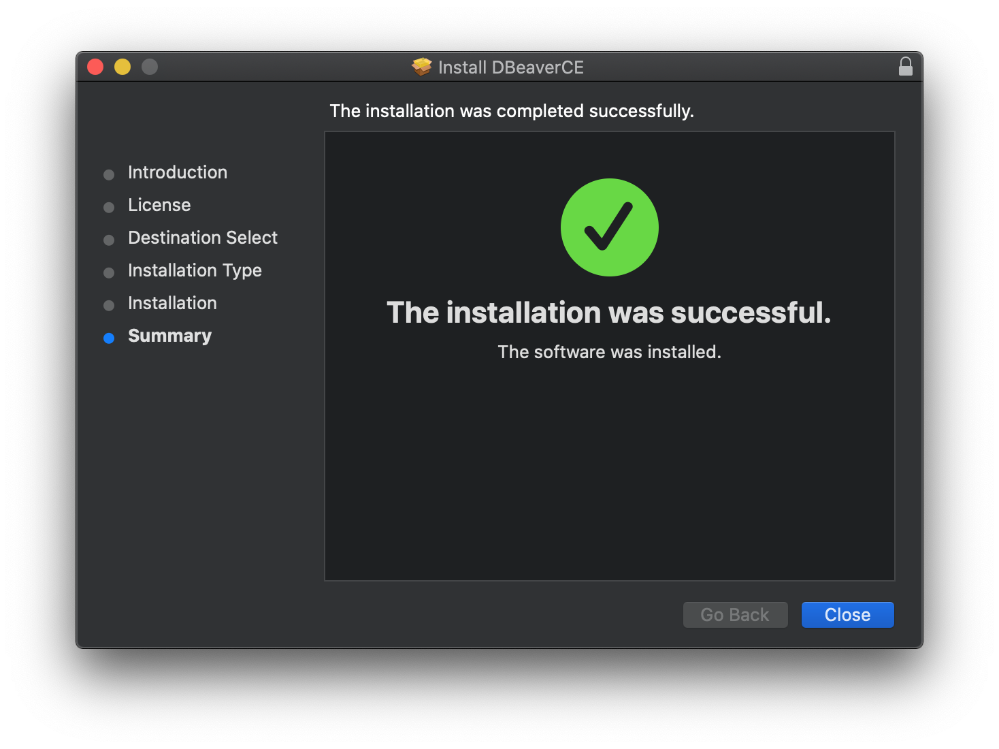

# Instalasi DBeaver pada macOS

DBeaver adalah sebuah aplikasi _Graphical User Interface_ untuk mengakses _database_ yang bersifat _relational_, seperti MySQL, PostgreSQL, SQLite, Oracle, dll.

Langkah-langkah instalasi DBeaver pada macOS adalah:

1. Unduh _installer_ dari halaman [_website_ DBeaver](https://dbeaver.io/download/)

   

2. Klik _continue_ pada bagian _Introduction_.

   

3. Klik _continue_ pada bagian _License_. Kemudian, klik _Agree_ pada _pop up_ yang muncul.

   

   

4. Klik _continue_ pada bagian _Destination Select_.

   

5. Klik _continue_ pada bagian _Installation Type_.

   

6. Tunggu instalasi selesai. Jika sudah selesai, klik _Finish_.

   

   
