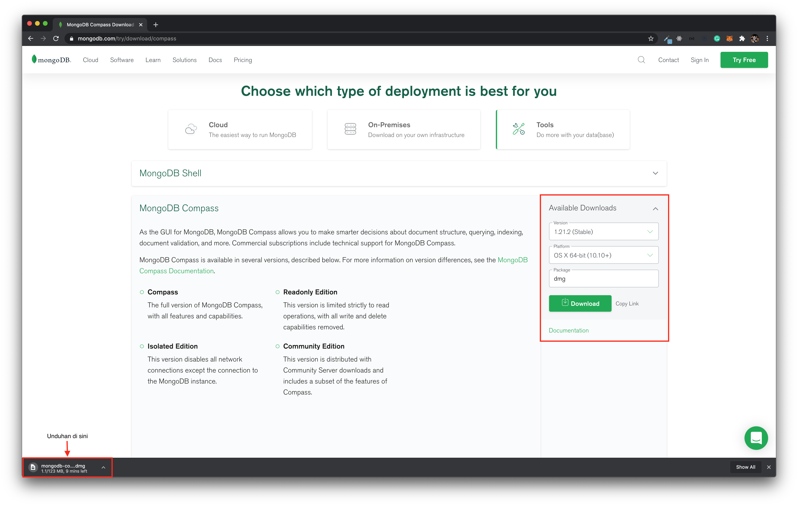
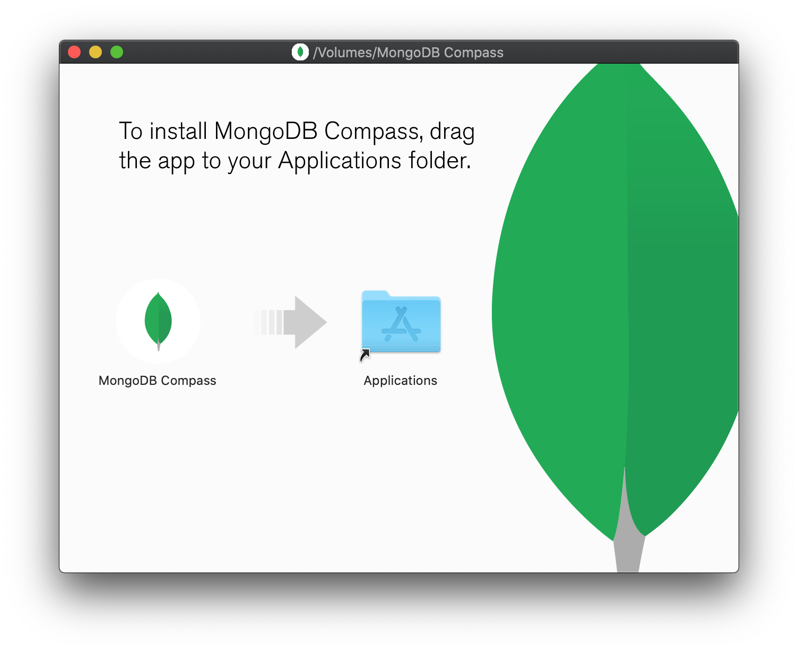

# Instalasi MongoDB Compass pada macOS

MongoDB Compass adalah sebuah aplikasi _Graphical User Interface_ untuk mengakses _database_ MongoDB, baik _local database_ maupun _remote database_.

Langkah-langkahnya:

1. Unduh _installer_ dari halaman [_website_ MongoDB](https://www.mongodb.com/try/download/compass). Pilih versi MongoDB Compass yang stabil, kemudian pilih "OS X" sebagai platformnya, dan terakhir pilih "dmg" sebagai *package*nya. Klik tombol "_download_"

   
   '

2. Jika selesai diunduh, buka _installer_. Maka akan keluar _window_ untuk melakukan instalasi. _Drag and drop_ gambar MongoDB Compass ke _folder_ Application. Instalasi akan dilakukan secara otomatis.

   

   Jika instalasi sudah selesai, maka aplikasi MongoDB Compass sudah tersedia di folder Application.
