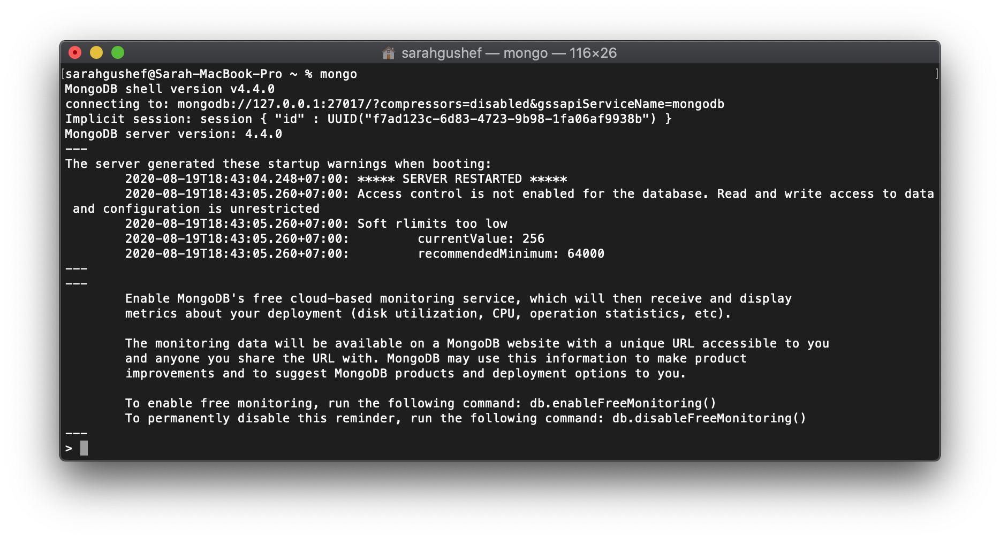

# Instalasi MongoDB pada macOS

Berikut adalah cara instalasi MySQL pada macOS:

## Instalasi MongoDB menggunakan Homebrew Pada macOS Catalina

Instalasi MongoDB pada Catalina akan sedikit berbeda dengan instalasi pada macOS lainnya. Permasalahannya adalah secara _default_, MongoDB menyimpan informasi _database_ pada _root folder_, yaitu pada folder `data/db`, namun pada Catalina, _root folder_ hanya berifat _read-only access_, sehingga kita harus memindahkan folder `data/db` ke folder `/System/Volumes/Data` (sebenarnya bisa di folder lainnya, tapi menurut [Bret Cameron](https://medium.com/better-programming/installing-mongodb-on-macos-catalina-aab1cbe0c836)), folder ini lebih aman.

Langkah-Langkahnya adalah:

1. Instal XCode pada dari Apple Store di link [ini](https://apps.apple.com/id/app/xcode/id497799835?mt=12). XCode memiliki _command-line tools_ yang dibutuhkan oleh Homebrew.

2. Instal Homebrew dengan menjalankan _script_ di bawah ini pada _terminal_ (skip langkah ini jika sudah melakukan instalasi Homebrew sebelumnya):

   ```zsh
   /bin/bash -c "$(curl -fsSL https://raw.githubusercontent.com/Homebrew/install/master/install.sh)"
   ```

   Jika sudah selesai, cek apakah Homebrew telah terinstal dengan baik menggunakan:

   ```zsh
   brew --version
   ```

3. Menonaktifkan _System Integrity Protection_, agar kita bisa mengakses `/System`, dengan cara:

   - Melakukan _boot_ ke _recovery mode_ dengan cara melakukan _restart_ pada macbook sambil menekan `cmd + R` selama _boot-up_

   - Membuka _terminal_ setelah masuk ke _recovery mode_. Terminal berada di menu _Utilities_ pada _dropdown menu_ di pojok kiri atas.

   - Pada terminal, jalankan

     ```zsh
     csrutil disable
     ```

   - _Restart_ kembali macbook kita.

4. Setelah kita masuk ke sistem normal seperti biasa, bukalah terminal dan ketik:

   ```zsh
   sudo mount -uw /
   ```

   Jika Anda memiliki data di dalam `/data/db` pada _root folder_, maka kita bisa pindahkan _folder_ tersebut ke dalam `/System/Volumes/Data/`. Kemampuan _read and write_ saat ini hanya akan bertahan pada saat sesi ini saja.

5. Sekarag, kita bisa mulai menginstal MongoDB. Pertama kita akan menambahkan _mongodb homebrew tap_ dengan _command_:

   ```zsh
   brew tap mongodb/brew
   ```

6. Install MongoDB Communitiy Edition dengan _command_:

   ```zsh
   brew install mongodb-community@4.4
   ```

   Hasil instalasi di atas akan membuat:

   - _Configuration file_ pada `usr/local/etc/mongodb.conf`
   - _Log directory path_ pada `usr/local/var/log/mongodb`
   - _data directory path_ pada `usr/local/var/mongodb`

7. Jalankan MongoDB dengan cara:

   ```zsh
   brew services start mongodb-community
   ```

   atau

   ```zsh
   brew services start mongodb-community
   ```

   > Catatan:
   >
   > - Gunakan `start` ketika kita ingin agar MongoDB berjalan saat kita _login_ ke Macbook.
   > - Gunakan `run` jika kita hanya butuh menjalankan MongoDB pada saat dibutuhkan saja.

   Lanjutkan dengan _command_:

   ```zsh
   mongod
   ```

8. Untuk menggunakan MongoDB agar kita bisa menuliskan _query_ dan memanipulasi _database_, maka kita perlu masuk ke dalam _mongo shell_ dengan menjalankan:

   ```zsh
   mongo
   ```

   Tampilan _mongo shell_ akan sepert ini:

   
