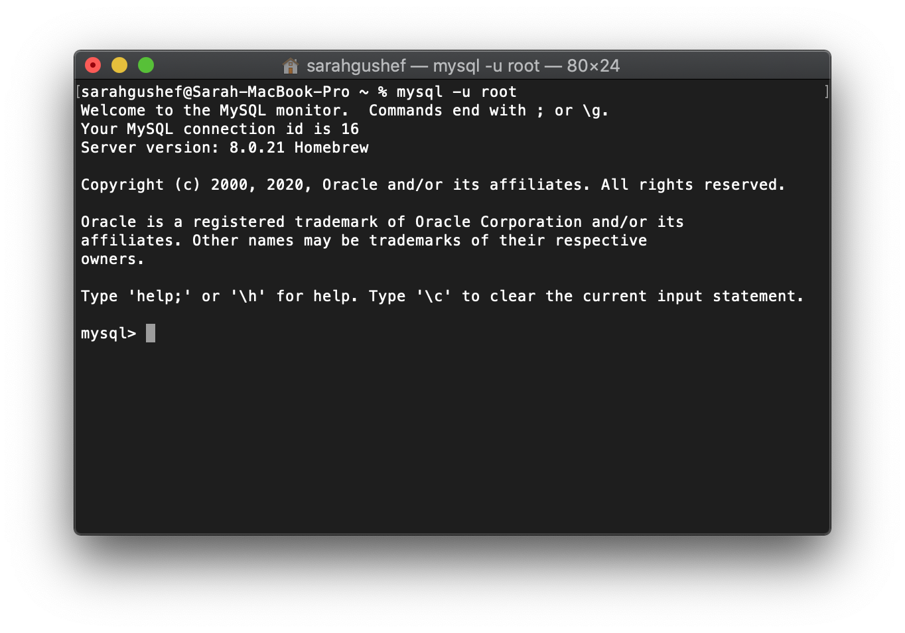
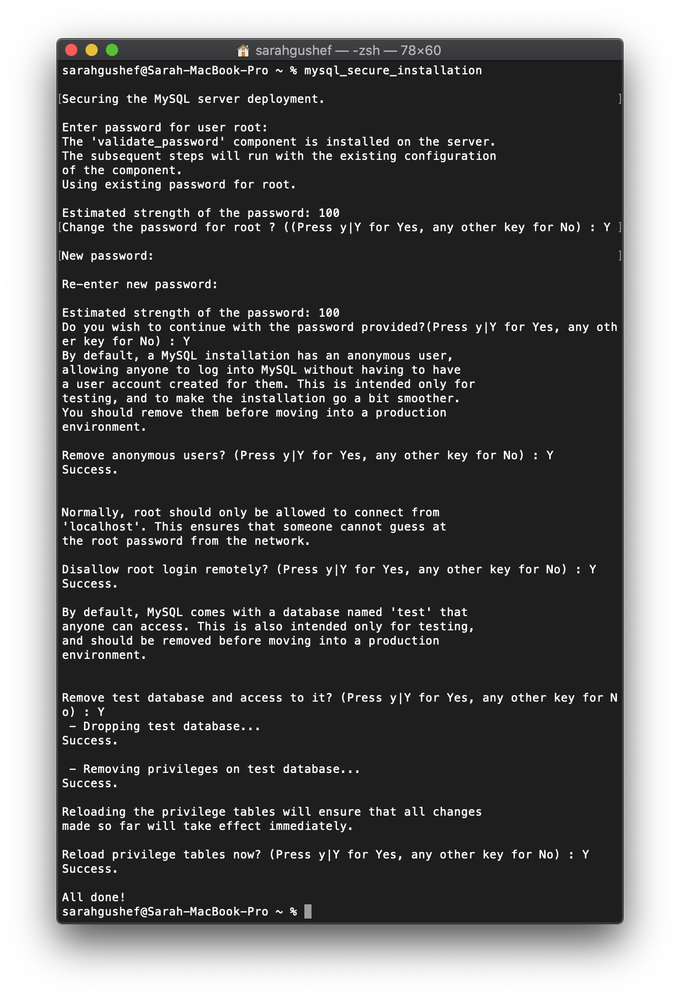

# Instalasi MySQL pada macOS

Berikut adalah cara instalasi MySQL pada macOS:

## Instalasi MySQL menggunakan Homebrew

1. Instal Homebrew dengan menjalankan _script_ di bawah ini pada _terminal_:

   ```zsh
   /bin/bash -c "$(curl -fsSL https://raw.githubusercontent.com/Homebrew/install/master/install.sh)"
   ```

   Jika sudah selesai, cek apakah Homebrew telah terinstal dengan baik menggunakan:

   ```zsh
   brew --version
   ```

2. Instal MySQL menggunakan HomeBrew dengan cara:

   ```zsh
   brew install mysql
   ```

   Jika sudah selesai, cek apakah MySQL sudah terinstal dengan baik dengan:

   ```zsh
   mysql --version
   ```

   _Command_ di atas akan menampilkan versi MySQL yang terinstal. Secara _default_, MySQL _root user_ terinstal tanpa _password_.

3. Jalankan MySQL server dengan:

   ```zsh
   brew services start mysql
   ```

   Sampai di sini, MySQL sudah siap digunakan.

4. Nah, untuk menjalankan _query_ MySQL, maka kita perlu masuk ke dalam MySQL monitor, dengan cara:

   ```zsh
   mysql -u root
   ```

   Tampilannya akan seperti ini:

   

5. Jika ingin menambahkan keamanan pada akses ke _MySQL server_, seperti menambahkan _password_ pada _root user_, mencegah akses secara _remote_, dll, maka bisa jalankan:

   ```zsh
   mysql_secure_installation
   ```

   Akan ada beberapa pertanyaan yang bisa kalian jawab, silahkan dijawab sesuai dengan keinginan Anda.

   Pada contoh di bawah, kami jawab _Yes_ semua, dan pada saat memasukan _password_ baru, apa yang kita ketikan tidak akan terlihat:

   

6. Jika _root user_ sudah memiliki _password_, maka untuk masuk ke _MySQL monitor_ harus dengan:

   ```zsh
   mysql -u root -p
   ```

   Setelah menjalankan _command_ di atas, maka kita masukan _password_ masing-masing setelahnya (jangan kaget jika tidak terlihat apa yang kita ketikan)
