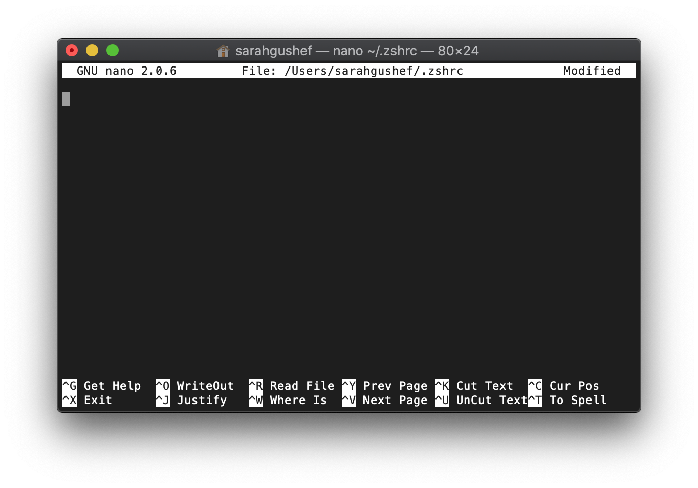
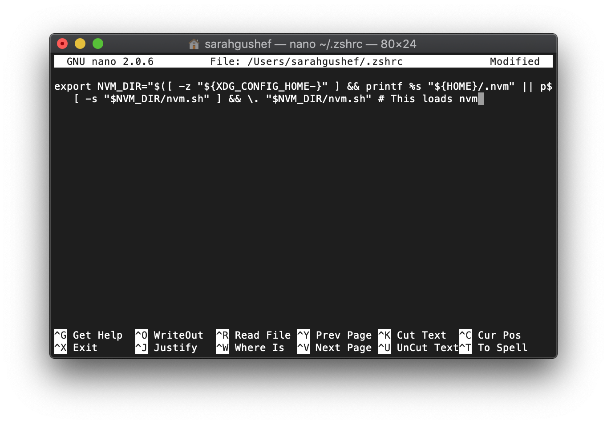
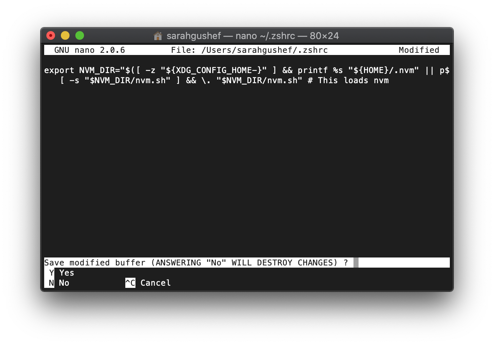
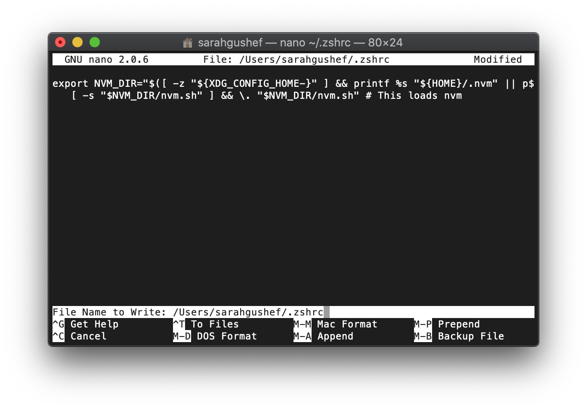

# Instalasi Node.js pada macOS

Berikut ini adalah cara instalasi Node.js pada macOS:

## Instalasi Node.js menggunakan `nvm`

1. Jika Anda menggunakan `bash` pada _terminal_, maka buatlah _file_ `~/.bash_profile` dan `~/.bashrc` pada _root_

   ```zsh
   touch ~/.bash_profile
   ```

   ```zsh
   touch ~/.bashrc
   ```

   Jika Anda menggunakan `zsh` pada _terminal_, buatlah _file_ `~/.zshrc` pada _root_.

   ```zsh
   touch ~/.zshrc
   ```

2. Jalankan salah satu _script_ cURL atau Wget di bawah ini:

   ```zsh
   curl -o- https://raw.githubusercontent.com/nvm-sh/nvm/v0.35.3/install.sh | bash
   ```

   atau

   ```zsh
   wget -qO- https://raw.githubusercontent.com/nvm-sh/nvm/v0.35.3/install.sh | bash
   ```

   _script_ di atas akan membuat folder `.nvm` pada _root_. Cek apakah terdapat _file_ tersebut dengan:

   ```zsh
   find ~/.nvm
   ```

3. Jika Anda menggunakan `zsh`, salin _script_ dibawah ini ke dalam _file_ `~/.zshrc` yang telah kita buat sebelumnya (Jika Anda menggunakan `bash` pada _terminal_, Anda bisa lewati langkah ini karena _script_ di bawah sudah otomatis disematkan pada `~/.bashrc`)

   ```zsh
   export NVM_DIR="$([ -z "${XDG_CONFIG_HOME-}" ] && printf %s "${HOME}/.nvm" || printf %s "${XDG_CONFIG_HOME}/nvm")"
   [ -s "$NVM_DIR/nvm.sh" ] && \. "$NVM_DIR/nvm.sh" # This loads nvm
   ```

   _Script_ diatas berfungsi untuk menjalankan `nvm` pada komputer kita.

   Untuk menyalin, bukalah terlebih dahulu file `.zshrc` dengan _command_:

   ```zsh
   nano ~/.zshrc
   ```

   Maka, tampilan akan seperti ini:
   

   Kemudian salin _script_ di atas seperti ini:
   

   Kemudian tekan tombol `command + X` untuk keluar, lalu tekan `Y` untuk menyimpan perubahan

   

   Terakhir, tekan `enter` untuk menyimpan nama file `.zshrc`

   

4. Tutup _terminal_, dan buka kembali untuk menggunakan `nvm`. Cek apakah `nvm` telah bisa dijalankan dengan:

   ```zsh
   nvm --version
   ```

   _Script_ di atas akan menampilkan versi `nvm` yang terinstal.

5. Sekarang, kita bisa instal Node.js dengan menggunakan:

   ```zsh
   nvm install --lts
   ```

   _command_ di atas akan menginstal versi _long term support_ dari Node.js

   Jika sudah selesai, cek apakah Node.js sudah terinstal dengan baik dengan:

   ```zsh
   node --version
   ```

   _command_ di atas akan menampilkan versi Node.js yang terinstal
