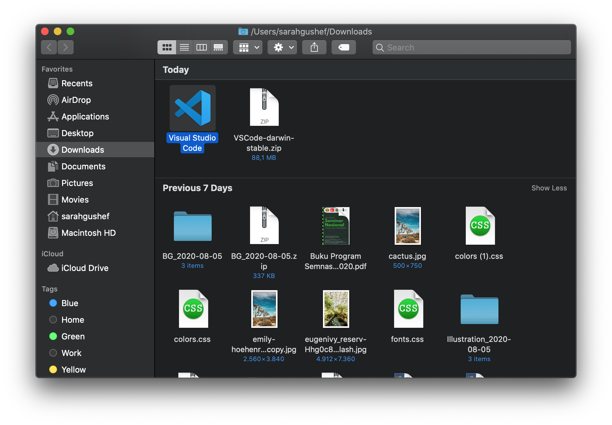

# Instalasi Visual Studio Code

Berikut ini adalah cara melakukan instalasi VS Code pada masing-masing _operating system_.

## Instalasi Visual Studio Code pada macOS

1. Buka [tautan ini untuk mengunduh VS Code](https://code.visualstudio.com/Download)

2. Klik VS Code _installer_ untuk macOS
   

3. Tunggu VS Code _installer_ Anda selesai diunduh.
   

4. Setelah selesai diunduh, buka VS Code _installer_ Anda dan klik dua kali. VS Code akan terinstal secara otomatis.
   
   

5. Secara _default_, VS Code akan terinstal di dalam folder Downloads, bersama dengan *installer*nya. Anda bisa pindahkan VS Code ke dalam folder Applications agar lebih rapi.