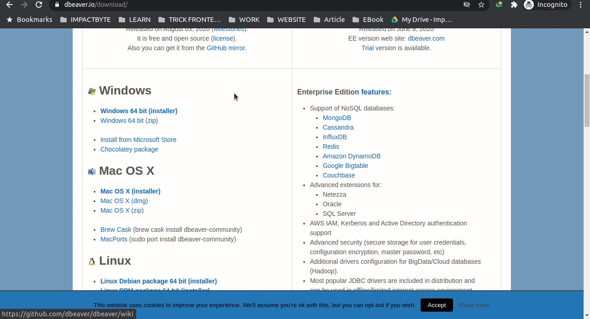
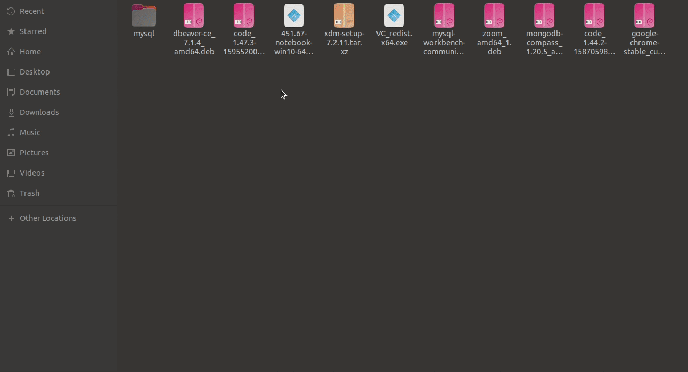

# Instalasi DBeaver Pada Ubuntu

1. Buka tautan [ini](https://dbeaver.io/download/) untuk mengunduh aplikasi dbeaver.

2. Pilih dbeaver untuk linux, kemudian tunggu hingga proses download selesai. 

3. Setelah diunduh, kita klik 2 kali pada aplikasinya kemudian akan diarahkan ke aplikasi _Ubuntu Software_. Kemudian pilih _Install_ dan masukan password laptop anda.

4. Tunggu hingga proses instalasi selesai. 

5. Setelah instalasi selesai kita bisa cek pada menu, kemudian cari dbeaver pada menu kita. 

6. Aplikasi dbeaver sudah bisa digunakan.
