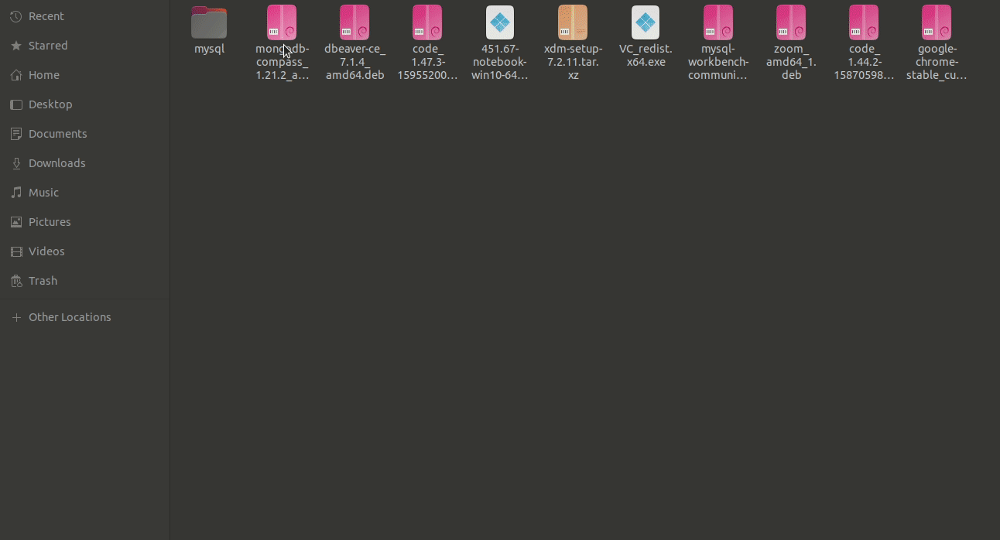

# Instalasi Mongo Compass pada Ubuntu

1. Buka tautan [ini](https://www.mongodb.com/try/download/compass) untuk mengunduh aplikasi mongo compass terlebih dahulu.

2. Pilih versi sesuai dengan sistem kita, kemudian tunggu hingga proses download selesai. 

3. Setelah diunduh, kita klik 2 kali pada aplikasinya kemudian akan diarahkan ke aplikasi _Ubuntu Software_. Kemudian pilih _Install_ dan masukan password laptop anda.

4. Tunggu hingga proses instalasi selesai. 

5. Setelah instalasi selesai kita bisa cek pada menu, kemudian cari compass pada menu kita. 

6. Aplikasi Mongo Compass sudah bisa digunakan.
