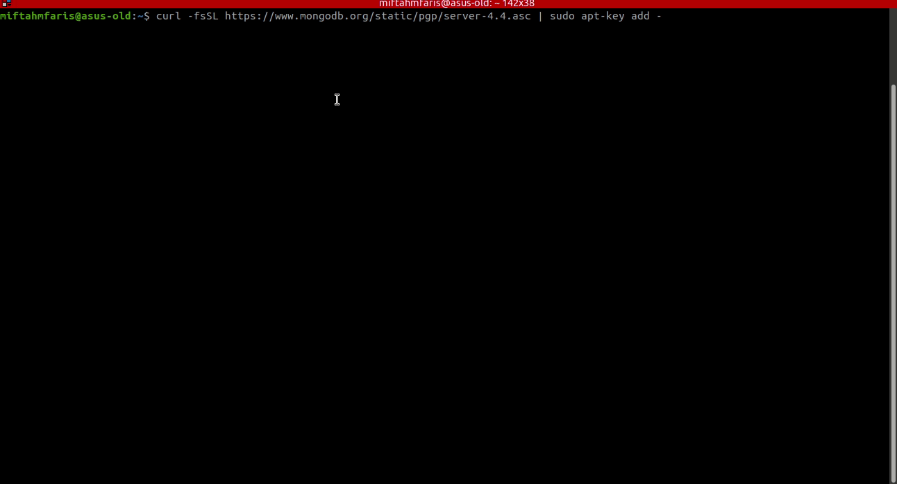
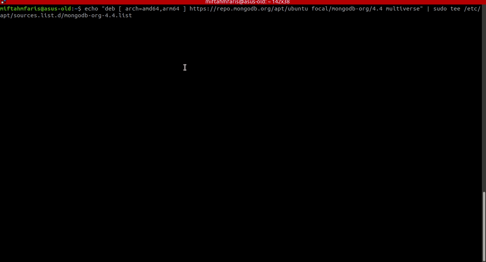
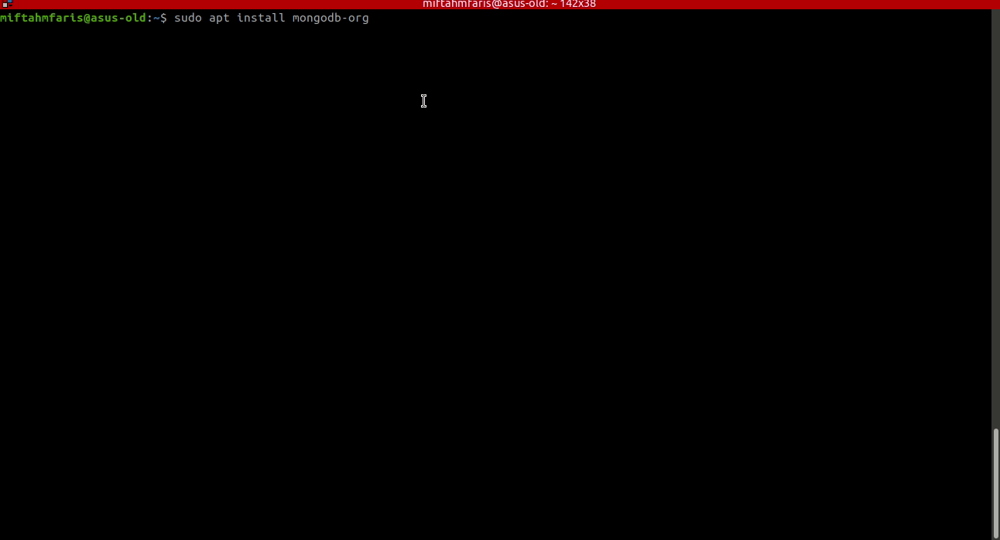
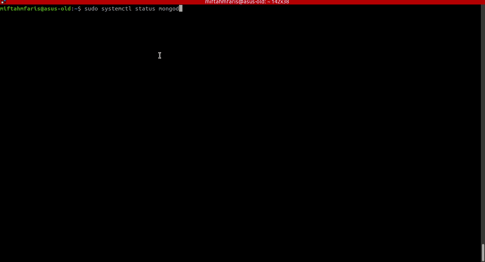
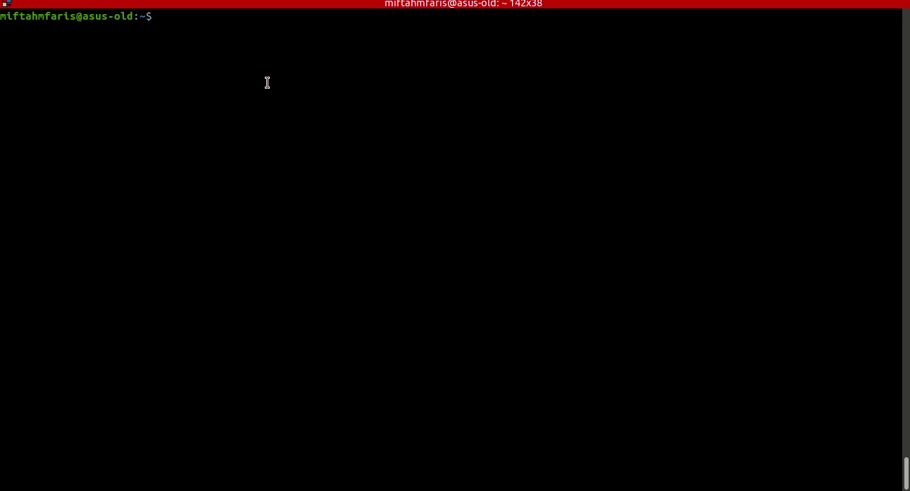

# Instalasi MongoDB Pada Ubuntu

1. Jalankan perintah `curl -fsSL https://www.mongodb.org/static/pgp/server-4.4.asc | sudo apt-key add -` pada terminal. 

2. Kemudian jalankan perintah `echo "deb [ arch=amd64,arm64 ] https://repo.mongodb.org/apt/ubuntu focal/mongodb-org/4.4 multiverse" | sudo tee /etc/apt/sources.list.d/mongodb-org-4.4.list` untuk menambahkan _source_ instalasi mongodb. Dan jalankan `sudo apt-get update`. 
_note: perintah `echo ....` disesuaikan dengan versi ubuntu kalian, contoh disini menggunakan ubuntu 20.04_

3. Setelah proses update selesai, jalankan instalasi mongodb dengan perintah `sudo apt install mongodb-org` dan tunggu sampai proses selesai. 

4. Setelah selesai jalankan perintah `sudo systemctl start mongod` untuk menjalankan service mongodbnya dan `sudo systemctl status mongod` untuk mengecek status dari mongodbnya. Jika sudah hijau atau aktif maka mongodb sudah bisa digunakan. 

5. Jalankan `mongo` untuk masuk ke mongodb shell. 