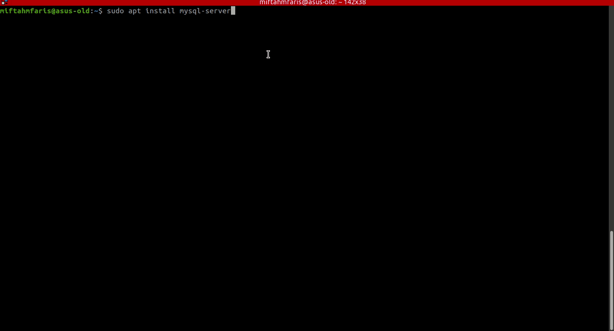
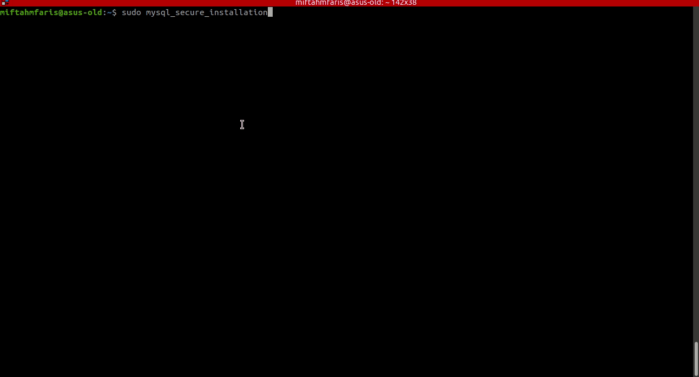
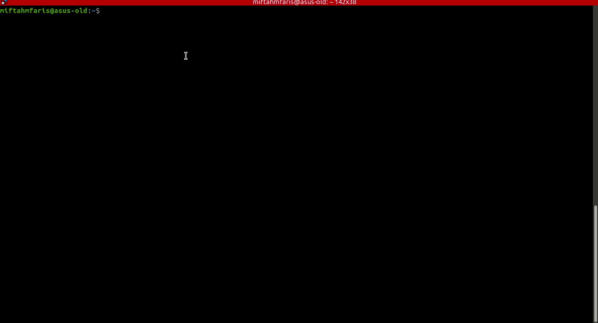
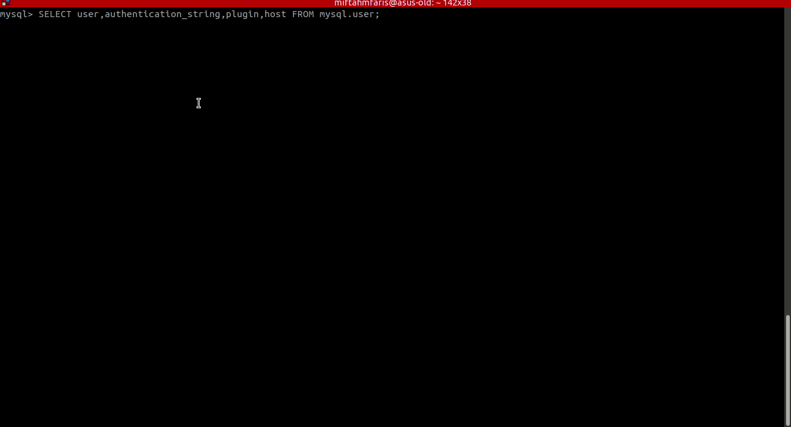
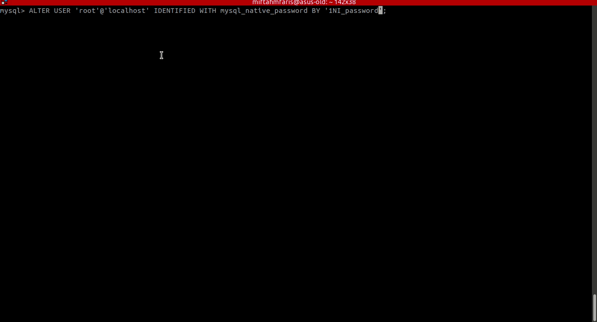

# Instalasi MySQL pada Ubuntu

1. Jalankan perintah ini diterminal `sudo apt update`.

2. Kemudian install mysqlnya dengan perintah `sudo apt install mysql-server` dan pilih `Y` untuk melanjutkan instalasi, tunggu hingga proses instalasi mysql selesai.
   

3. Setelah proses instalasi selesai jalankan perintah `sudo mysql_secure_installation` untuk pengaturan selanjutnya. Masukan password untuk root, kemudian ikutin langkah dibawah.  
   

4. Setelah proses setelah, jalankan perintah `sudo mysql -u root -p` kemudian masukan password yang kalian buat pada proses sebelumnya. Perintah ini untuk bertujuan untuk masuk _command line_ dari mysql. 

5. Kemudian kita coba cek password untuk root apa sudah ada atau belum dengan menjalankan perintah `SELECT user,authentication_string,plugin,host FROM mysql.user;`. 

6. Jika pada kolom authentication_string root sudah ada isinya maka proses instalasi sudah selesai. Sedangkan jika belum ada isinya maka jalankan perintah `ALTER USER 'root'@'localhost' IDENTIFIED WITH mysql_native_password BY 'isi_password_anda_sendiri';`. Jika sudah berhasil jalankan perintah `FLUSH PRIVILEGES;` dan cek kembali password root anda dengan menjalankan perintah `SELECT user,authentication_string,plugin,host FROM mysql.user;`. 
