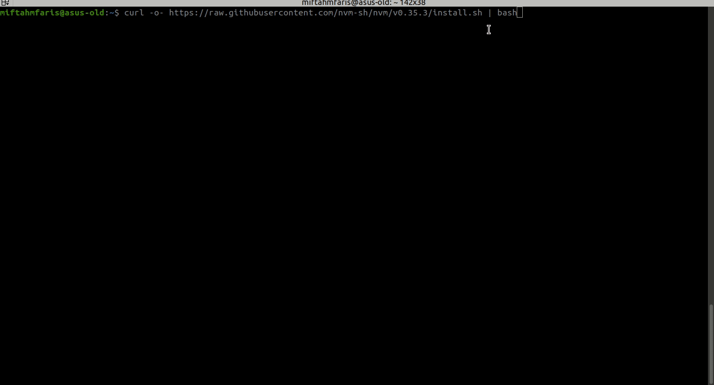
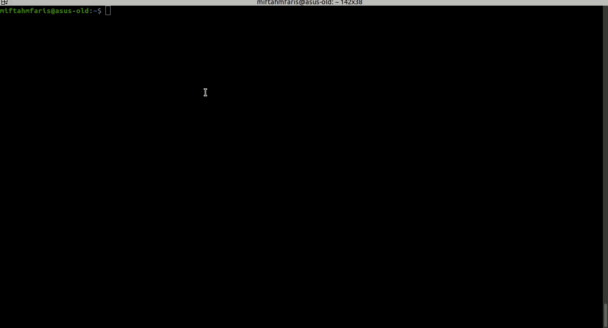
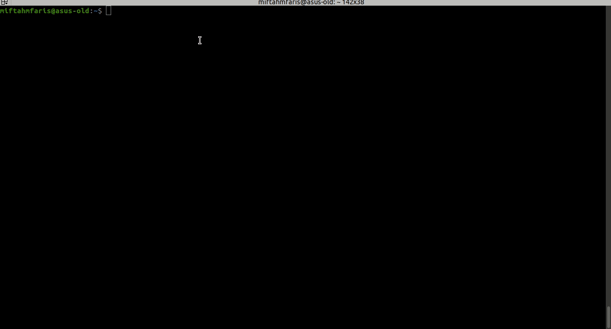
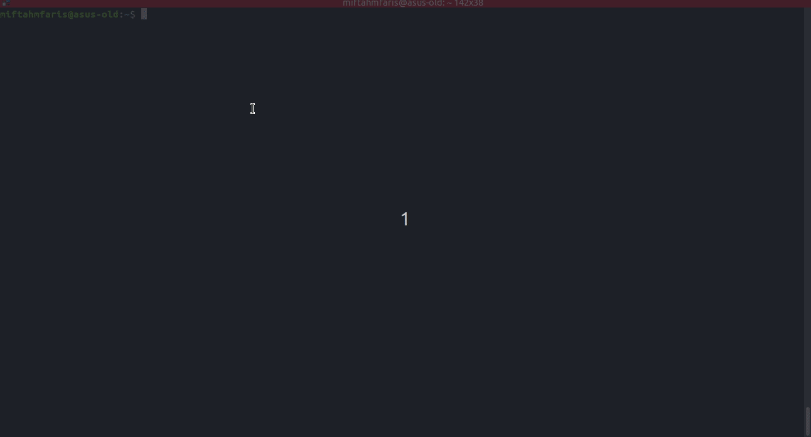

# Instalasi NodeJS Pada Ubuntu

Pada tutorial ini, kita akan melakukan instalasi menggunakan nvm (Node Version Manager). Karena untuk melakukan _maintenance_ nodejs kita menjadi lebih mudah.

1. Jalankan perintah ini pada terminal

   `curl -o- https://raw.githubusercontent.com/nvm-sh/nvm/v0.35.3/install.sh | bash`

   atau

   `wget -qO- https://raw.githubusercontent.com/nvm-sh/nvm/v0.35.3/install.sh | bash`

   

2. Setelah selesai kita bisa mengecek versi dari nvm itu sendiri dengan menggunakan _syntax_ `nvm --version` pada terminal. 
   _note: jika belum jalankan `source .bashrc` atau `source .profile` kemudian jalankan lagi `nvm --version`_

3. Jika sudah bisa melakukan pengecekan nvm, kita bisa langsung instalasi nodejs dengan syntax `nvm install --lts`, kemudian tunggu hingga proses instalasi selesai. 

4. Jika sudah kita tinggal melakukan pengecekan versi dari node yang sudah kita install dengan menggunakan syntax `node --version`. Jika sudah terlihat versi dari nodenya berarti kita sudah berhasil melakukan instalasi nodejs pada linux ubuntu kita. 
