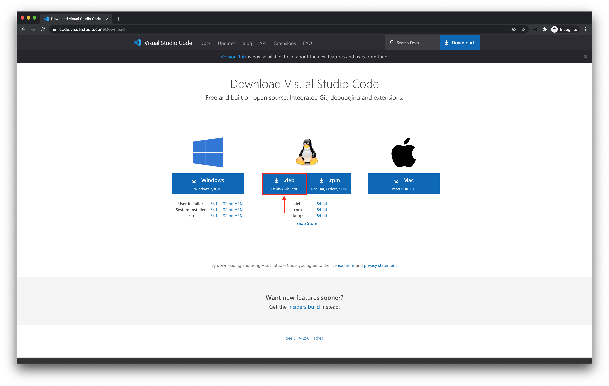
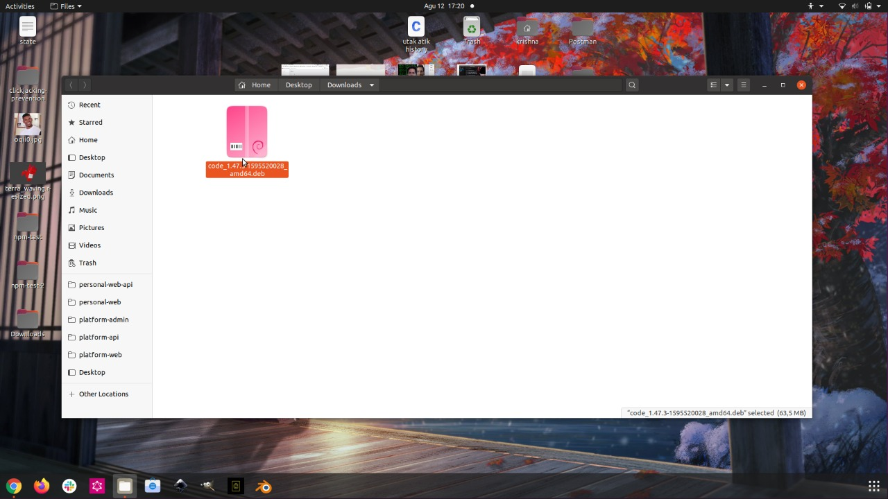
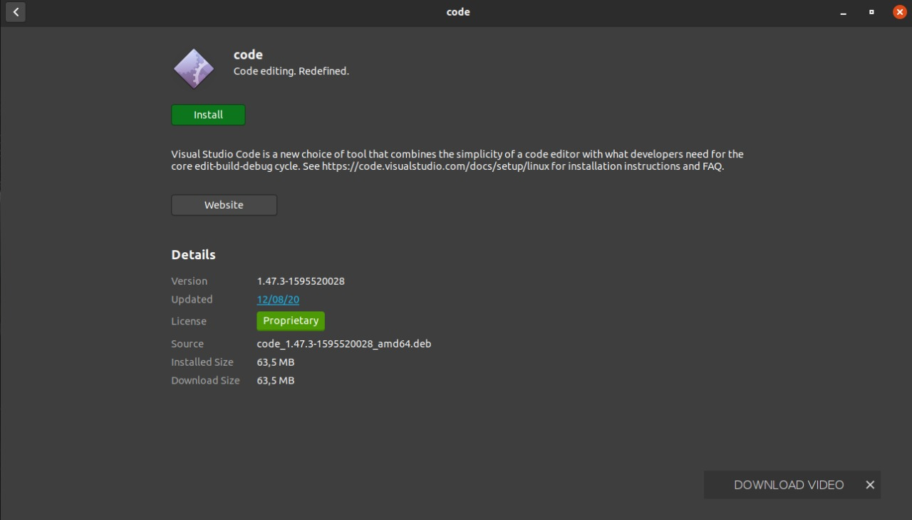
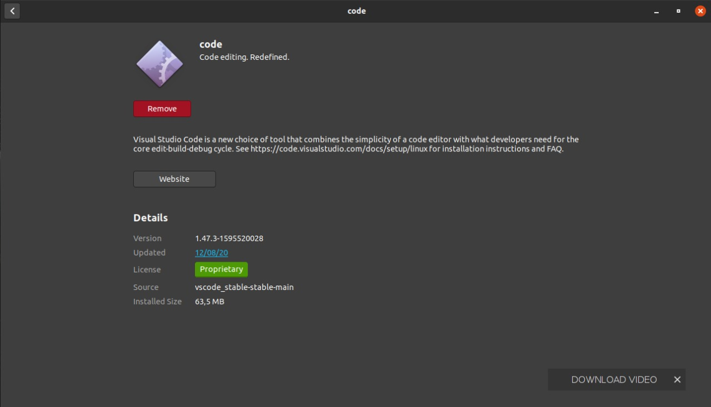
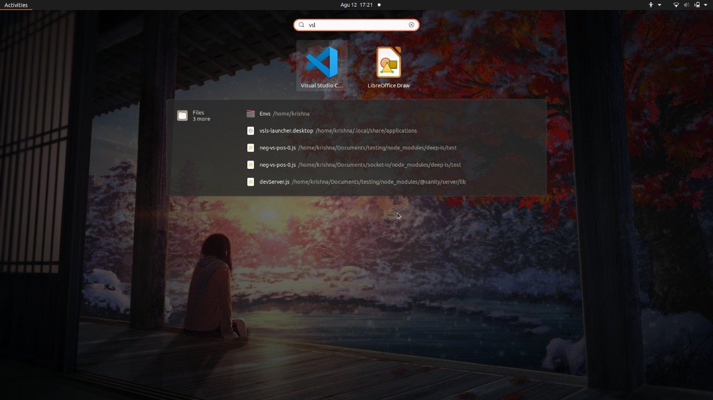

# Instalasi Visual Studio Code

Berikut ini adalah cara melakukan instalasi VS Code pada masing-masing _operating system_.

## Instalasi Visual Studio Code pada Ubuntu

1. Buka [tautan ini untuk mengunduh VS Code](https://code.visualstudio.com/Download)

2. Klik VS Code _installer_ untuk macOS
   
3. Tunggu VS Code _installer_ Anda selesai diunduh.

4. Bukalah VS Code _installer_ Anda
   

5. Kemudian klik _install_ pada jendela _installer_. VS Code akan otomatis terinstal (tombol _install_ akan berubah menjadi warna merah jika instalasi selesai)
   
   

6. Cek pada menu untuk memastikan VS Code sudah terinstal
   